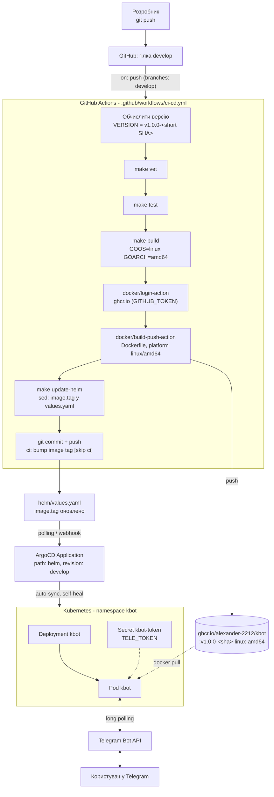

# kbot

Telegram-бот на Go для курсу GlobalLogic DEVOPS101.
Репозиторій містить код бота, `Dockerfile`, `Makefile`, Helm-чарт і повний
CI/CD-конвеєр (GitHub Actions -> ghcr.io -> ArgoCD -> Kubernetes).

Бот: [t.me/devops101KaminskyiOV_bot](https://t.me/devops101KaminskyiOV_bot)

## Стек

- [cobra](https://github.com/spf13/cobra) - CLI-фреймворк
- [telebot.v4](https://gopkg.in/telebot.v4) - Telegram Bot API
- GitHub Actions - CI/CD
- ghcr.io - реєстр контейнерів
- Helm + ArgoCD - GitOps-розгортання в Kubernetes

## CI/CD

Схема автоматизованого циклу: комміт у `develop` -> збірка й публікація образу
в `ghcr.io` -> оновлення тегу в Helm-чарті -> автоматичний sync ArgoCD у кластер.



### Умови завдання (Модуль 6)

| Пункт | Значення |
|---|---|
| CI/CD | GitHub Actions |
| Container Registry | `ghcr.io` |
| Deploy | ArgoCD |
| Infrastructure | Kubernetes |
| Event | `push` у гілку `develop` |
| Платформа / архітектура | `linux` / `amd64` |

Результуючий образ: `ghcr.io/alexander-2212/kbot:v1.0.0-<short-sha>-linux-amd64`,
що відповідає полям `image` у [`helm/values.yaml`](helm/values.yaml):

```yaml
image:
  registry: "ghcr.io"
  repository: "alexander-2212/kbot"
  tag: "v1.0.0-<short-sha>"
  os: linux
  arch: amd64
```

### Кроки workflow

1. `checkout` гілки `develop` (повна історія - потрібен SHA для версії).
2. Обчислення версії `v1.0.0-<short SHA>` і повного посилання на образ.
3. `make vet` і `make test` - статичний аналіз і тести.
4. `make build` - крос-компіляція бінарника під `linux/amd64`.
5. Логін у `ghcr.io` вбудованим `GITHUB_TOKEN` (`packages: write`).
6. `docker/build-push-action` - збірка образу з `Dockerfile` і публікація тегу
   `v1.0.0-<sha>-linux-amd64`.
7. `make update-helm` - оновлення `image.*` у `helm/values.yaml`.
8. Комміт і `push` оновленого чарту назад у `develop`.

Комміт від `GITHUB_TOKEN` не запускає workflow повторно; додатково гілки чарту
виключені через `paths-ignore: helm/**`, тож нескінченного циклу немає.

## Розгортання через ArgoCD

Маніфест Application - [`argocd/kbot-application.yaml`](argocd/kbot-application.yaml).

```bash
# 1. Токен бота (у git не зберігається)
kubectl create namespace kbot
kubectl -n kbot create secret generic kbot-token --from-literal=token=<TELE_TOKEN>

# 2. Application
kubectl apply -f argocd/kbot-application.yaml

# 3. Стан
kubectl -n argocd get application kbot
kubectl -n kbot get pods
kubectl -n kbot logs -l app.kubernetes.io/instance=kbot -f
# authorized as @devops101KaminskyiOV_bot, version v1.0.0-<sha>
```

ArgoCD працює в режимі `automated` + `selfHeal`, тож після комміту нового тегу
в `values.yaml` нова версія бота розкочується без ручних дій.

Якщо пакет у `ghcr.io` приватний, додайте pull-секрет:

```bash
kubectl -n kbot create secret docker-registry ghcr   --docker-server=ghcr.io --docker-username=<github-user> --docker-password=<PAT>
# і в values.yaml: imagePullSecrets: [{name: ghcr}]
```

## Локальна збірка

```bash
make help          # список цілей і поточні змінні
make image-name    # ghcr.io/alexander-2212/kbot:v1.0.0-<sha>-linux-amd64
make build         # бінарник під linux/amd64
make image         # образ локально
make image-push    # зібрати і запушити в ghcr.io
make update-helm   # оновити image.* у values.yaml
make helm-lint     # helm lint
```

Версія вшивається в бінарник через `-ldflags -X ...cmd.appVersion`, тож
`kbot version` показує ту саму версію, що й тег образу.

## Ручне встановлення чарту (без ArgoCD)

```bash
helm upgrade --install kbot helm   --namespace kbot --create-namespace   --set tele.existingSecret=kbot-token
```

Основні параметри:

| Параметр | За замовчуванням | Опис |
|---|---|---|
| `image.registry` | `ghcr.io` | реєстр образу |
| `image.repository` | `alexander-2212/kbot` | репозиторій образу |
| `image.tag` | `v1.0.0-<sha>` | тег, оновлюється CI |
| `image.os` / `image.arch` | `linux` / `amd64` | суфікс платформи в тезі |
| `tele.existingSecret` | `kbot-token` | наявний Secret із токеном |
| `tele.token` | `""` | створити Secret із чарту |
| `replicaCount` | `1` | long polling - одна репліка |

## Команди бота

| Команда | Відповідь |
|---|---|
| `hello` | привітання з іменем користувача |
| `version` | версія бота |
| `time` | поточний час сервера |
| `help` | список доступних команд |

## Локальний запуск без контейнера

```bash
export TELE_TOKEN=<your_bot_token>
go build -o kbot . && ./kbot start
```
